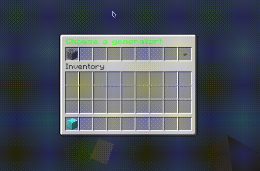

# Introduction

[AdvancedOreGen](https://pluginboard.com/plugin/advancedoregen) is a superior ore generation plugin that comes with a handy GUI interface and a few additions on top of [CustomOreGen](/plugin/customoregen/).

## Features
All features from CustomOreGen plus:
- Simple configuration
  - Configuration via an inventory interface - No need to reload
- [Selactable generators](./usage.md#generator-selector)
  - Your users can select between multiple generators they have unlocked in a nice GUI
- [Offline owner support](./usage.md#offline-owner-support)
  - Works when the island owner is offline (caching of permission).
- [AFK feature](./usage.md#afk-feature)
  - You can define a generator a player would get as soon as the player is afk.
- Permission AND Level
  - Generator are choosen by both permission and level, so you can create VIP generators etc.
- Fence Generators
  - You can enable this in the config.yml
- [Placeholders](./usage.md#placeholders)
- [ItemsAdder](https://itemsadder.plugin.ga/) is supported, so you can use custom blocks.
- Works with a large varity of SkyBlock plugins, see [CustomOreGen](/plugin/customoregen/installation.html#supported-skyblock-plugins).
- Fast generators (Turn obsidian into a normal generator instead that is faster)

