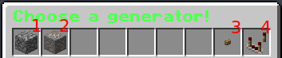
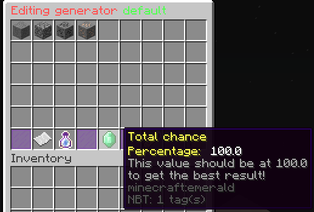
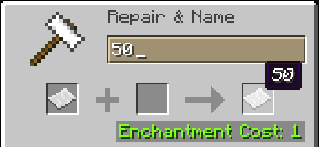
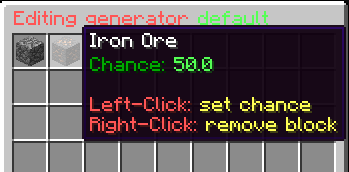
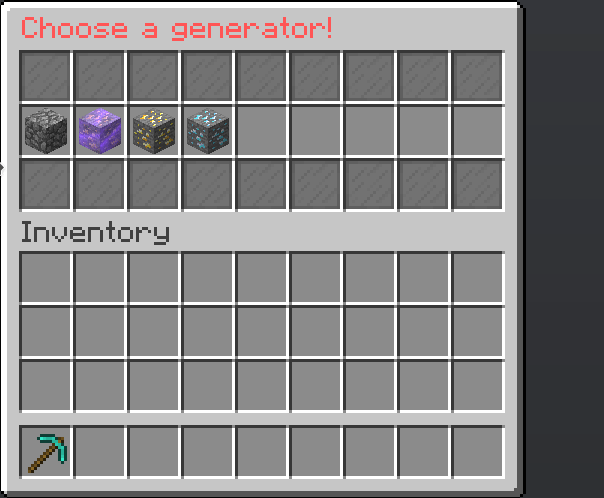
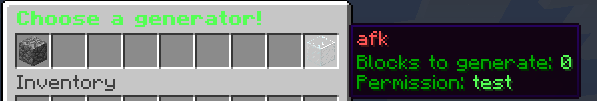

# Usage

## Setting up a generator
​
The whole configuration is made through the GUI or alternatively by modifying the config.yml.
​
### Migrating from CustomOreGen
​
If you come from CustomOreGen, and want to use your config.yml from it, just place the CustomOreGen config.yml in the AdvancedOreGen folder and start the plugin.
​
### Understanding the generator mechanics
​
The plugin allows you to customize different generator presets for certain permission, thus, for instance, you're able to create a default generator generating cobblestone and a vip generator creating cobblestone and gold:
​



​
​
Generator #1 was set up with the permission `oregen.default` and Generator #2 with `oregen.vip`, therefor you need to provide the respective permission to your players.
​
Assuming the island owner has the permission `oregen.vip` and mines at a cobblestone generator, then the player will get the last configuration preset for which the player has permission for.
That means the plugin basically iterates from left to the right and checks if the player has permission and stops at the last generator the player has permission for.
​
Moreover, the plugin chooses the generator by the island owner's permission, not by the player that is mining.
​
​
Your players are also able to choose between generators, see generator selector.
​
### Creating new generator presets
​
You can add new generators and it's permission by typing the following exemplary commands, or by selecting the wooden button item in the main GUI(3).
​
```yaml
/oregen generator add default oregen.default
/oregen generator add vip oregen.vip
```
​
​
where `default` and `vip` are the name of the generator preset and `oregen.default` and `oregen.vip` the permission.
​
After that, you may edit both generators by typing this command:
​
```yaml
/oregen edit
```
​
Now the GUI where you can choose the generator which you want to edit appears. (See last image).
​
Another GUI will pop up if you select a generator where you can put the blocks you want to be generated:
​


​

The emerald indicates the current percentage, which should always be at 100.0, otherwise the plugin wouldn't work correctly.
​
Let's say we want this generator to create 50% cobblestone and 50% iron ore, we need to proceed the following steps:
1. select a cobblestone block and an iron ore block from your inventory (Add it before editing).
2. click on each block in order to change the percentage; an anvil will be opened, put 50 in it
3. voila, your percentage should now be at 100.0.
​


​



​
Now you're ready to use the generator and you should now be able proceeding the same steps for the VIP generator!
​
### Reordering generators
​
Typing the command `/oregen order` will bring up the default editing GUI, but in ordering mode. Ordering mode means that the clicked generator will moved by one position to the right, simply swapping two generators. In this way, you can reorder your generators. Typing `/oregen edit` again will exit the ordering mode.

## Generator Selector



This generator menu gives your players the opportunity to select a generator they've already unlocked. This is useful when using differnt kinds of generators, for example an overworld ore generator and a nether generator which are unlocked on the same island level / player permission.

The default command is `/generator`, which can also changed in the config.yml. (permission is `advancedoregen.showgenerator`)

## AFK Feature
Since version 1.3.2, AdvancedOreGen includes a nice anti afk feature that allows you to give players who are mining AFK another generator.
AFK means, that the player doesn't change his position during mining.
You can enable this by uncommenting the following lines in your config.yml:

```yaml
#afk-generator-name: afk
#afk-after-x-seconds: 1200
```

By default, the player is handled as AFK after 20 minutes. Keep in mind that you need to set up an AFK - Generator, which should have the afk-generator-name, the permission is inconsequential.




## Offline Owner support
AdvancedOreGen caches the player permissions for keeping the same cobblestone generator after an owner of an island leaves the server. You can see an example here:


## Placeholders

The plugin uses the PlaceholderAPI and registers three different identifiers that display the current specifiations from a player's generator.
Some server owners make use of these Placeholders by creating their own /generator menu using [DeluxeMenus](https://www.spigotmc.org/resources/deluxemenus.11734/).


| Name | Placeholder | Description |
| -------- | -------- | -------- |
| Generator name     | %oregen_generator.label%     | Displays the generator name     |
| Unlock island level     | %oregen_generator.level%     | Displays the island level needed to unlock this generator     |
| Unlock permission     | %oregen_generator.permission%     | Displays the permission needed to unlock this generator     |

Reference: Current generator config of a player
