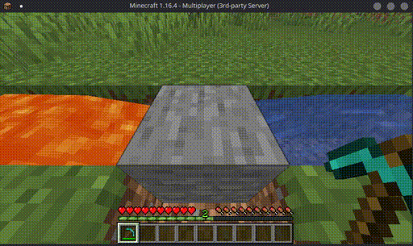
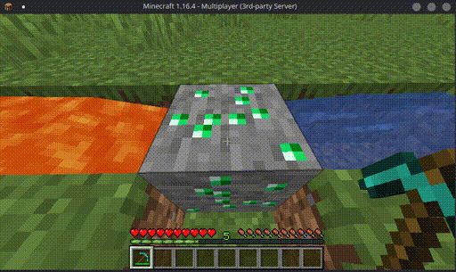

# Introduction

CustomOreGen gives you the ability to customize your SkyBlock server's cobblestone generator!
The generator can be customized by defining different materials and probabilities.

Its also possible to setup multiple groups or *tiers* of generators that can be unlocked when reaching a certain level or permission.

In the examples above, you can see a simple iron ore generator and a another tier that generates diamond ores and emerald ores.

## Features
* Different generator presets based on permission nodes and/or island levels
* Compatibile with a large varity of [SkyBlock plugins](installation.html#supported-skyblock-plugins)
* Configurable spawning rate of any block
* Item Sub IDs are supported (for older versions)
* Open Source: [Source](https://github.com/mastercake10/CustomOreGen)

::: tip
If you're looking for a plugin for configuring the generator in a **GUI** without reloading, you might want to consider the Premium version, [AdvancedOreGen](https://www.spigotmc.org/resources/advancedoregen.40527/).

It also allows you to use both **permission nodes and island levels**.
:::
