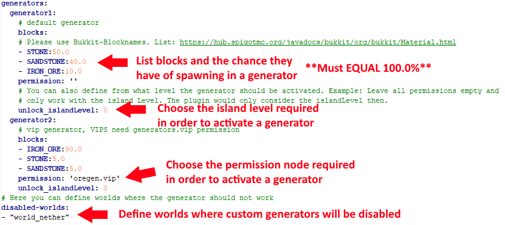

# Usage

The pre-generated configuration of CustomOreGen is quite self-explanatory when looking at the [config.yml](config.md) file, but still this "tutorial" might help.
 
## Tiers

Inside the `generator` section, you can define as many *tiers* as you want.

A tier ensembles a generator setup with all its blocks plus probabilities to generate, and the condition under which this tier will be applied (either *level* or *islandlevel*):
```yml
 generator1:
    label: "beginner"
    blocks:
    - STONE:50.0
    - SANDSTONE:40.0
    - IRON_ORE:10.0
    permission: ''
    unlock_islandLevel: 0
```

#### Important notices
- A generator category must include a 100.0% spawnrate. For example, in the screenshot below, STONE has a 50.0% of being produced, SANDSTONE has a 40.0% chance of being produced, and IRON_ORE has a 10.0% chance of being produced, equaling the 100.0% required (50.0% + 40.0% + 10.0% = 100.0%).

- When creating generators, each category should be named “generator1”, “generator2”, and so on.




::: warning
Use your Bukkit version specific material names: [Material enum](https://hub.spigotmc.org/javadocs/bukkit/org/bukkit/Material.html).
:::


### How does CustomOreGen chooses a Tier?

When a player breaks a block on a cobblestone generator, the plugin determines **the owner from the island** the player is standing on. 
After that, the plugin iterates all tiers in an ascending order and checks the requirements (either permission or the unlock_islandLevel). 

The winning tier is the last tier an island owner has permission for or the required island level.

::: tip Note
#### Permission
When unlocking a generator using permission nodes, the same generator can only be used by all island members if the island owner has the permission. Though, if the island owner goes offline, the default generator in the configuration file will be used.
#### Island Level
When unlocking a generator using island level, the generator will only apply to all island members unless the island owner goes offline. The default generator in the configuration file will be used when the island owner is not online.
:::
