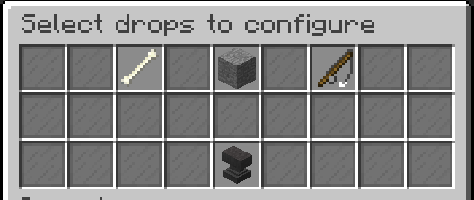
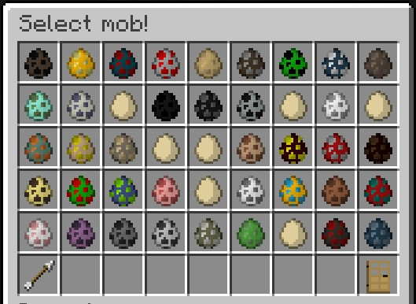
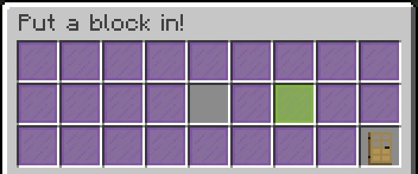
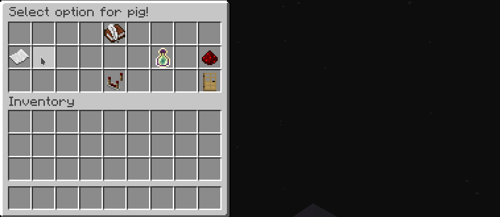
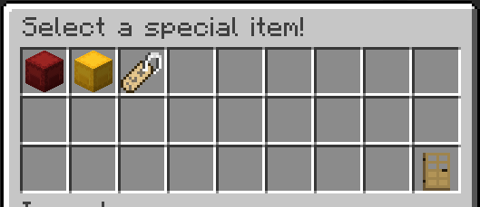
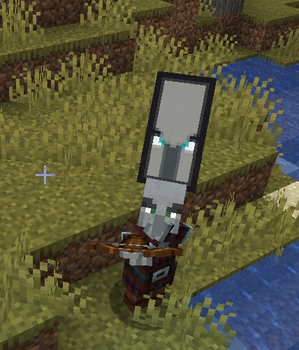
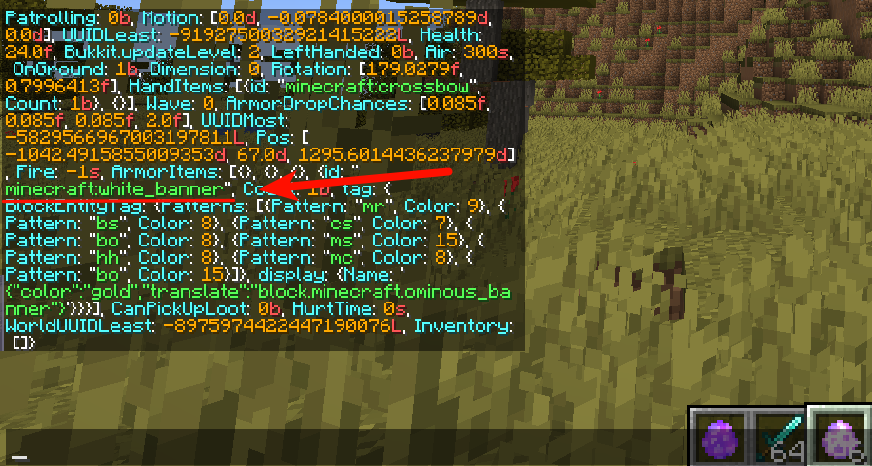
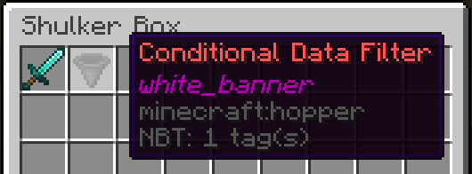
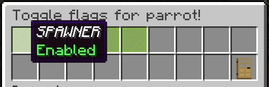

# Usage

All the drop configuration is done via the GUI. While it is pretty much self-explanatory, we will still give you a quick overview over all possiblities.

## Main GUI




### Drop Types
| Drop Type | Item in GUI | Description |
| -------- | -------- | -------- |
| Mob Drops     | Bone     | Allows you modifying the item and experience drop of all mobs     |
| Block Drops     | Stone     | Allows you modifying the item and experience drop of all blocks     |
| Fishing Drops     | Fishing Rod     | Allows you modifying the item and experience drop from fishing     |


## Mob Drops



The mob drop gui covers all entities found in vanilla minecraft. Using the arrow in the bottom left corner will turn the page.

If you have MythicMobs installed, it will add those mobs too.

After selecting a mob, the option gui will appear.


## Block Drops



Unlike the mob drop gui, you need to place a block you want to edit in the empty slot.

After clicking on the green glass pane, the option gui will pop up.


*Remember — DropEdit2 supports data values for mc < 1.13, thus you need paying attention to the data values!*


## Fishing Drops

Similar to mob drops.

## Option GUI



Each drop type contains an option GUI that has several items for customizing drops:


| Option | Item in GUI | Mob Drops | Block Drops | Fishing Drops |
| -------- | -------- | -------- | -------- | -------- |
| Set drops     | Written book     | Yes     | Yes     | Yes     |
| Edit mode     | Redstone repeater     | Yes     | Yes     | Yes     |
| Flags     | Paper     | Yes     | Yes     | No     |
| Vanilla drops     | Redstone     | Yes     | Yes     | Yes     |
| Experience     | Exp bottle     | Yes     | Yes     | Yes     |

## Setting Drops

Select a mob, block or fishing for editing drops.

### Edit modes

There are two different modes for setting the drop chances of an item drop. The classic mode for the lazy ones, and a precise mode that allows you to set very low dropping chances. This mode can be changed using the redstone repeater in any option GUI.

#### Classic Mode (default)

Using the classic mode, DropEdit2 would choose a random item depending on the presence of items in the 53 slots inventory. So each slot theoretically has a dropping chance of 1:53, so in order to create a 1:2 drop chance, for instance, you would need to fill a half of the inventory with an item.

#### Precise Mode

As stated above, the precise mode is very accurately. Thus you need to set a percentage for every item you put in. This can be done by right-clicking any item in the inventory, and typing the desired percentage in decimal using an anvil GUI.
To remove an item, simply shift-leftclick it.

*Your overall percentage should equal 100.0 for best results.*

## Special Items



### Command Tag

The Command Tag allows you to execute (via console) a defined command upon drop. It acts like a normal item within the drop inventory, but will execute a command instead of dropping it. It also will replace `%player%` with the player name.

### Batch Container

When putting Shulker Boxes into the custom drop inventory, they will act as "containers" for DropEdit.

A red shulker box lets you drop a bunch of items at once, so you can add a complete gear into one shulker box in order to drop that gear at once when randomly selected from the drop inventory.

### Expansion Container

A yellow shulker box expands the custom drop inventory by 27 slots. DropEdit will add all items configured in a yellow shulker box to the pool of items from which DropEdit chooses a random item afterward.

### Conditional Data Filter (Mob drops only)

This item can contain a specific filter string. When added to one of the container types listed above, it will only drop the contents of the container when the filter string is contained within the entity's data string. For example, you may want pillagers to drop a diamond sword, but only if they're pillager captains, meaning they're having banners on their head.



In order to accomplish this, you can run the vanilla command `/data get entity @e[type=minecraft:pillager,limit=1]` for getting an idea which part of the string data differs from the default villager. In this example, you can easily see that a captain pillager got a `white_banner` inside the `ArmorItems` category:



Now, run the command `/dropedit getfilter white_banner` in order to get the filter item (hopper). Add this to a shulker box (the batch container fits best for this) in order to put the condition on one or more items.
Finally, you can add the box as a custom drop.



## Flags



There are different toggleable flags for mob drops and block drops, which are explained below.

### Mob Drop Flags

You can disable or enable certain spawning flags when clicking on the "paper" item. An enabled flag means that the configured drops will drop when a mob dies when previously spawned by the respective spawn reason. To give an example: If you want to prevent players from farming rare item by standing next to a mob farm that spawns monsters by spawners, just disable the flag SPAWNER.

### Block Drop Flags

Analogous to the mob drops, block drops also support flags, but for other events. In this case, there are three events which are toggleable:


| Flag Name | Description |
| -------- | -------- |
| GAMEMODE_SURVIVAL, GAMEMODE_CREATIVE     | defines whether or not custom drops should drop when breaking a block in the given mode     |
| DROP_ONLY_NATURAL     | enabling this option will prevent players from obtaining configured drops twice after replacing a block.     |


### Vanilla Drops

It is possible to disable vanilla drops by clicking on the stick in the options menu, so the mob would not drop vanilla items but only custom items.

### Experience Drops

When clicking on the experience bottle, an anvil will open in which you can type in the desired exp amount. Setting the experience to -1 would cause the plugin to use the vanilla experience calculations.

# Misc
## Multipliers

All drops can be multiplied by a factor x using the permission node on the right site. The factor x should be greater than 1 and can vary from player to player or group to group.

Also, **enchantments** like looting or fortune will multiply drops. You can disable this in the config.yml.


```yml
permission: dropedit.multiplier.x
example: dropedit.multiplier.2
```

## Copying drop inventories

You might want to reuse pre-configured drop inventories for other drop configurations. For this, there is a command called `/dropedit copy <from> <to>`. *from* and *to* are the keynames, so material names for blocks, entity names for mobs and fishing for fishing. Additionally, you can use *inventory* as the *\<to\>* argument for copying all the items to your inventory.

## Localization

Inside the config.yml, you can set your preffered language.

You can also edit the language file en.yml, or just create a new one if your language is missing.

config.yml:

```yml
# available languages: EN, DE, RU
language: EN
```
