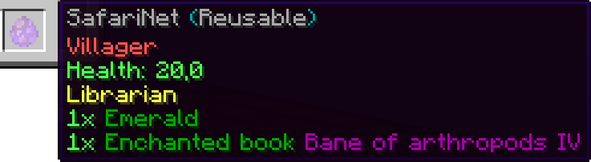

# Usage

SafariNets can be *crafted* or be *given* using [commands](./commands.md).

There are two types of SafariNets: **reusable** and **single-use**. The single-use safarinet will disappear after releasing a mob that got trapped into the safarinet before. The reusable egg can be used infinitely.

A mob can be caught by right-clicking on it with an empty safarinet in hand. Then it can be released by hand again or by using a *dispenser*.

## Crafting recipes

All crafting recipes can be changed in the `config.yml` to fit your requirements.
Permissions can be looked up on [Commands and Permissions](./commands.md).

::: warning
When changing the crafting recipes, please lookup the right material names for your version. You might need to prefix material with a `LEGACY_` depending on your versions.
:::

### Single-use


An enderpearl with strings surrounded

### Reusable


An eye of ender with strings surrounded

## Change default safarinet item

The default safarinet item can be changed by using the `/safarinet set` command. It creates a new configuration section in the config.yml, so basically overwriting the default item.

## Change spawner types

Your users might want to change spawner types by right-clicking with SafariNets. This works by giving them the following permission(s):

`safarinet.changespawnertype.primitiv.<entity-type>`

## Customizing the lore (Ability parsing)

You can customize the lores of all SafariNets by making use of the ability parsing system. It takes the NBT representation of an entity and reuses certain values (which you can specify) to create a formatted lore.

Each entity got its own abilities, thus there is a special parsing needed for the information an entity contain. For this you can open up the pre-generated `ability_parsing.yml` and change or add new abilities for any mob.

All entity configurations sit in `types`, while there is the `ALL` namespace for applying the lore to all entities.

Under each entity, you can add new *paths* following to the value in question.


### Example
For example, you might want to specify whether or not a pig has a saddle:

```yml
types:
   pig:
      Saddle:
         label: " → &eHas saddle: %s"
         nbtValueTranslations:
         - "1b:Yes"
         - "0b:No"
```
The `nbtValueTranslations` is a lookup table for SafariNet to replace "unreadable" strings to human readable words. The result is then placed into the `label`, using the `%s` parameter for formatting. Finally the string gets appended to the lore.

Another example is a villager showing its trades:
```yml
types:
   villager:
      VillagerData_profession:
          type: "string"
          format: "parseid"
          label: "&e%s"
      Offers_Recipes[0]_sell:
           type: "item"
      Offers_Recipes[1]_sell:
           type: "item"
      Offers_Recipes[2]_sell:
           type: "item"
```


It follows the path VillagerData -> profession and then applys the formatting on the value. 

The offers are parsed by getting the Offers, then the Recipes array and selecting a certain entry in the array, followed by the final `sell` key. The NBT item is then parsed to an item name + amount internally (*type item*).

### Formats

There is also a `format` attribute that can be used to format the path's value:

#### capitalize
Capitalized a string

#### parseid
Parses an item id to a real item name, so `minecraft:oak_log` becomes `Oak Log`

#### uuidToName
Turns a player UUID to a name

