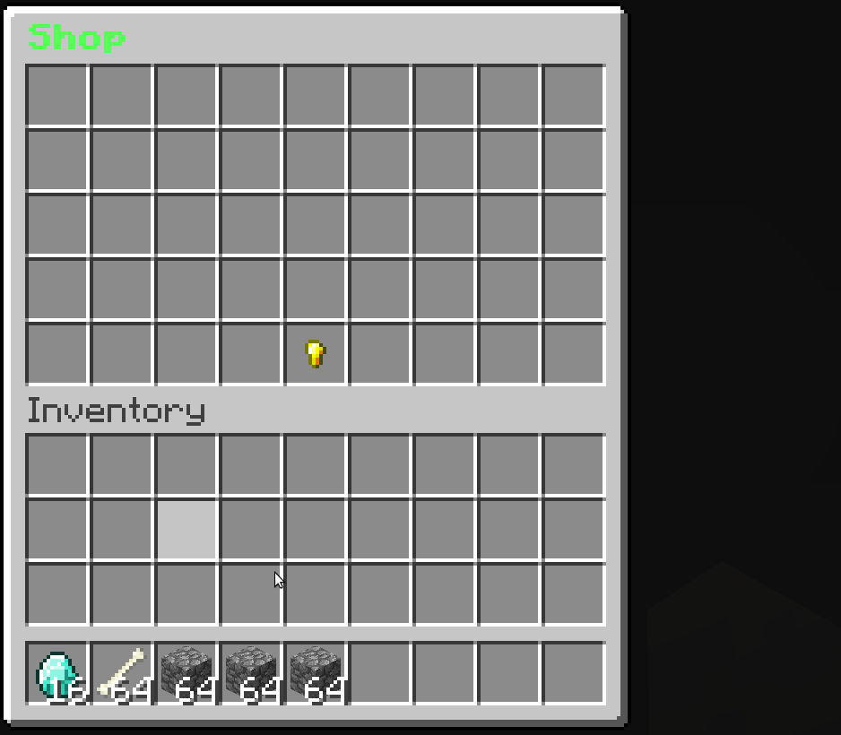

# Introduction

This guide will assist you in setting up your item sale shop.

This plugin offers a fancy way of selling items to the server. Unlike the default /sell command of Essentials, uShop provides a nice GUI which displays the current worths of any item that were put in the GUI. uShop is a must-have for every survival and skyblock server!

## Features
* Bulk sell items
* All items are supported, including enchanted items, items with lore, displayname and so on.
* Customizable GUI
* Ability to add Flags, so you can ignore certain item meta values like enchantments.
* Built-in Essentialsx worth converter